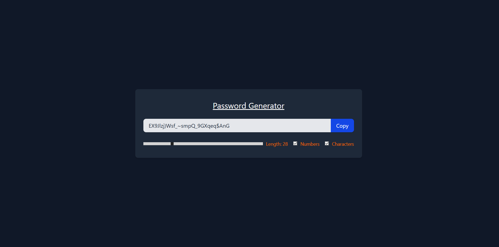

# 🔒 React Password Generator

A secure and user-friendly password generator built with **React** and styled with **Tailwind CSS**. This application allows users to create strong, customizable passwords and copy them to the clipboard with a single click. It's a practical demonstration of fundamental and advanced React hooks like `useState`, `useCallback`, `useEffect`, and `useRef`.




---

## ✨ Features

-   **Customizable Length:** Adjust the password length from 6 to 100 characters using an intuitive range slider.
-   **Character Options:** Include or exclude numbers and special characters to meet various security requirements.
-   **Real-time Generation:** The password automatically regenerates whenever the criteria are changed.
-   **One-Click Copy:** A convenient "Copy" button to instantly copy the generated password to the clipboard.
-   **Responsive Design:** A clean, modern interface that is fully responsive and looks great on any device.
-   **Optimized Performance:** Utilizes `useCallback` to memoize functions, preventing unnecessary re-renders and ensuring a smooth user experience.

---

## 🛠️ Technologies Used

-   **[React](https://reactjs.org/)**: For building the user interface and managing component state.
-   **[Vite](https://vitejs.dev/)**: As the blazing-fast frontend build tool.
-   **[Tailwind CSS](https://tailwindcss.com/)**: For utility-first styling and responsive design.

---

## 💡 Core Concepts Demonstrated

This project is an excellent example of several key React concepts:

-   **`useState`**: Manages the state for password length, character inclusion options (numbers, special characters), and the final generated password.
-   **`useCallback`**: Optimizes performance by memoizing the `passwordGenerator` and `copyPasswordToClipboard` functions, ensuring they are not recreated on every render unless their dependencies change.
-   **`useEffect`**: Triggers the `passwordGenerator` function whenever the length, number, or character inclusion settings are modified by the user, creating a reactive experience.
-   **`useRef`**: Creates a reference to the password `input` element, allowing the `copyPasswordToClipboard` function to select the text for a better user experience upon copying.

---

## 🚀 Getting Started

To get a local copy up and running, follow these simple steps.

### Prerequisites

Make sure you have [Node.js](https://nodejs.org/) and `npm` (or `yarn`) installed on your system.

### Installation

1.  **Clone the repository:**
    ```sh
    git clone [https://github.com/your-username/react-password-generator.git](https://github.com/your-username/react-password-generator.git)
    ```

2.  **Navigate into the project directory:**
    ```sh
    cd react-password-generator
    ```

3.  **Install NPM packages:**
    ```sh
    npm install
    ```

4.  **Run the development server:**
    ```sh
    npm run dev
    ```
    Open [http://localhost:5173](http://localhost:5173) (or the port shown in your terminal) to view it in the browser.

---

## 📄 License

This project is distributed under the MIT License. See `LICENSE` for more information.
